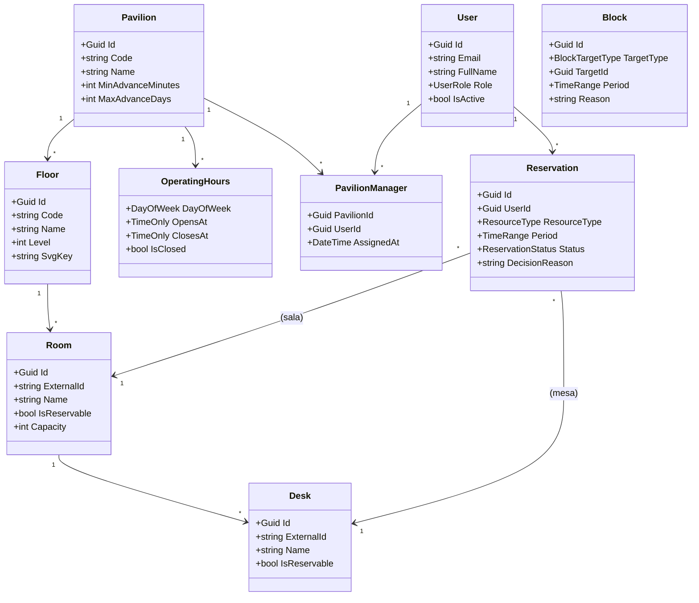
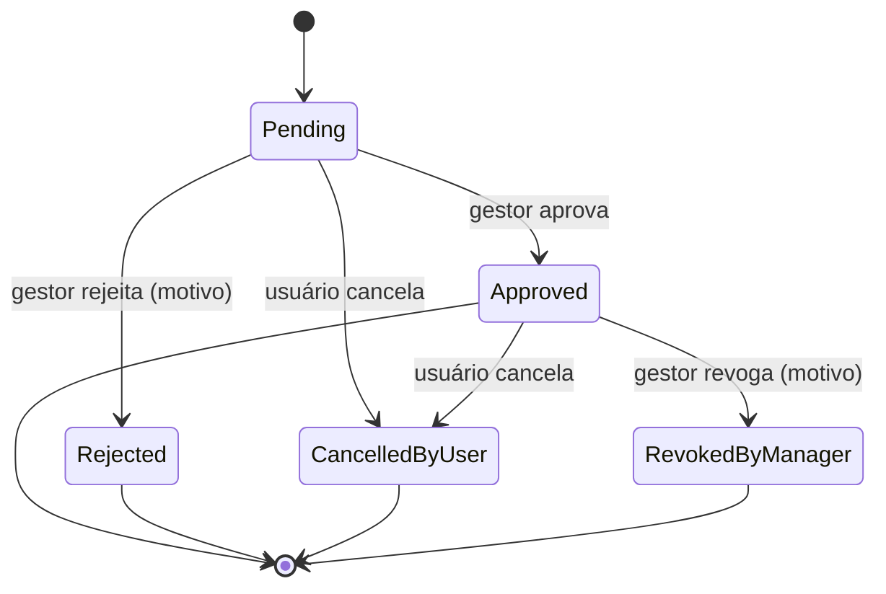

# Alloca — Visão Geral do Projeto

> Sistema de alocação de espaços acadêmicos (salas e mesas) para bibliotecas e
> ambientes compartilhados. Documento de escopo e requisitos do projeto
> (versão enxuta, desenvolvida como Trabalho de Conclusão de Curso).

---

## 1. Problema

Bibliotecas e espaços acadêmicos oferecem salas de estudo, cabines e mesas que
são disputadas pelos usuários, mas cuja gestão ainda é feita de forma manual
(planilhas, cadernos na recepção ou "ordem de chegada"). Isso gera:

- **Conflitos de uso** — duas pessoas alocadas no mesmo recurso e horário.
- **Falta de visibilidade** — o usuário não sabe o que está livre sem ir ao local.
- **Subutilização** — recursos ficam ociosos por ausência de controle.
- **Dificuldade de gestão** — não há como bloquear um espaço para manutenção ou
  evento de forma organizada, nem histórico de quem usou o quê.

**Objetivo do projeto:** oferecer uma plataforma web onde os usuários visualizam
a planta do espaço, consultam a disponibilidade em tempo real e solicitam a
reserva de uma sala ou mesa, enquanto os gestores aprovam, bloqueiam recursos e
a administração mantém o cadastro dos espaços.

---

## 2. Escopo

### 2.1 Dentro do escopo

- Cadastro hierárquico de espaços: **Pavilhão → Andar → Sala → Mesa**.
- **Planta interativa em SVG** para seleção visual do recurso.
- Consulta de **disponibilidade** por período, com resolução de conflitos
  hierárquicos (sala ⇄ mesas).
- **Reserva** de sala inteira ou de mesa, sujeita a **aprovação do gestor**.
- **Bloqueios administrativos** de pavilhão, sala ou mesa (manutenção/eventos).
- **Horário de funcionamento** configurável por pavilhão.
- Autenticação com três papéis: **Member**, **PavilionManager** e **Admin**.

### 2.2 Fora do escopo (removido em relação à versão anterior)

- Check-in por QR Code e controle de comparecimento (no-show).
- Penalidades automáticas (strikes) e suspensão de usuários.
- Jobs recorrentes / transições automáticas de estado.
- Internacionalização (apenas pt-BR), dashboards com gráficos e histórico.
- Editor de texto rico e feature flags.

---

## 3. Papéis de usuário

| Papel               | Permissões                                                                                                    |
| ------------------- | ------------------------------------------------------------------------------------------------------------- |
| **Member**          | Consultar disponibilidade, solicitar e cancelar suas próprias reservas.                                       |
| **PavilionManager** | Tudo do Member + aprovar/rejeitar/revogar reservas **e** criar bloqueios **apenas dos pavilhões que gerencia**. |
| **Admin**           | Visão global: tudo do gestor em **qualquer** pavilhão + cadastrar pavilhões/recursos, gerenciar usuários e designar gestores. |

> Um pavilhão pode ter um ou mais gestores (relação N:N entre `User` e `Pavilion`).
> O gestor só enxerga e atua sobre reservas/bloqueios dos seus pavilhões.

---

## 4. Requisitos Funcionais (RF)

### Autenticação e usuários
- **RF01** — O sistema deve permitir que um usuário se autentique com e-mail e senha.
- **RF02** — O sistema deve permitir o cadastro de novos usuários (papel Member por padrão).
- **RF03** — O Admin deve poder listar, criar, editar, ativar/inativar usuários e redefinir senhas.

### Espaços e recursos
- **RF04** — O Admin deve poder cadastrar pavilhões, andares, salas e mesas.
- **RF05** — Cada sala e mesa deve indicar se é reservável e sua capacidade.
- **RF06** — O Admin deve poder configurar o horário de funcionamento por dia da semana de cada pavilhão.
- **RF07** — O sistema deve exibir a planta do andar em SVG, destacando os recursos.
- **RF08** — O Admin deve poder **designar/remover gestores** de um pavilhão.

### Disponibilidade e reserva
- **RF09** — O usuário deve poder consultar a disponibilidade dos recursos de um andar para um período informado.
- **RF10** — O sistema deve considerar indisponível um recurso que esteja reservado, bloqueado, ou cujo pai/filho esteja reservado (sala ⇄ mesas).
- **RF11** — O usuário deve poder solicitar a reserva de uma sala ou de uma mesa para um período.
- **RF12** — O sistema deve validar a reserva contra o horário de funcionamento, a antecedência e a duração permitidas.
- **RF13** — Toda reserva deve nascer com status **Pendente** e aguardar decisão do gestor.
- **RF14** — O usuário deve poder cancelar suas reservas pendentes ou aprovadas.
- **RF15** — O usuário deve poder listar suas reservas e seus status.

### Aprovação e bloqueios (gestão)
- **RF16** — O gestor deve poder listar as reservas pendentes **dos pavilhões que gerencia**; o Admin, de todos.
- **RF17** — O gestor/Admin deve poder **aprovar** ou **rejeitar** (com motivo) uma reserva pendente sob sua gestão.
- **RF18** — O gestor/Admin deve poder **revogar** uma reserva já aprovada (com motivo).
- **RF19** — O gestor/Admin deve poder criar **bloqueios** de pavilhão, sala ou mesa sob sua gestão, com motivo.
- **RF20** — O gestor deve poder listar os bloqueios **dos seus pavilhões**; o Admin, de todos.

---

## 5. Requisitos Não Funcionais (RNF)

- **RNF01 — Segurança:** autenticação via JWT; senhas armazenadas com hash
  (PBKDF2); autorização por papel **e por pavilhão** (o gestor só atua nos
  pavilhões que gerencia).
- **RNF02 — Consistência temporal:** todas as datas são persistidas em **UTC** e
  exibidas no fuso de Brasília (−03:00) na interface.
- **RNF03 — Integridade:** o sistema não deve permitir reservas conflitantes;
  a verificação de conflito ocorre no momento da confirmação.
- **RNF04 — Usabilidade:** interface responsiva com seleção visual do recurso
  pela planta SVG; mensagens de erro claras e localizadas em pt-BR.
- **RNF05 — Manutenibilidade:** backend em **Clean Architecture** (6 camadas),
  com regras de negócio isoladas no domínio e testáveis independentemente.
- **RNF06 — Portabilidade:** banco de dados executável via Docker; migrations e
  seed aplicados automaticamente no boot da API.
- **RNF07 — Desempenho:** a consulta de disponibilidade de um andar deve
  responder em tempo interativo (< 1s em condições normais).
- **RNF08 — Observabilidade:** logs estruturados das operações relevantes
  (reservas, aprovações, bloqueios).

---

## 6. Modelo de Domínio



### Estados da reserva



### Enumerações

- **UserRole:** `Member`, `PavilionManager`, `Admin`.
- **ResourceType:** `Room`, `Desk`.
- **ReservationStatus:** `Pending`, `Approved`, `Rejected`, `CancelledByUser`, `RevokedByManager`.
- **BlockTargetType:** `Pavilion`, `Room`, `Desk`.

### Política de reserva (configurável)

| Parâmetro              | Padrão | Descrição                                   |
| ---------------------- | ------ | ------------------------------------------- |
| `MinDurationMinutes`   | 30     | Duração mínima de uma reserva.              |
| `MaxDurationMinutes`   | 120    | Duração máxima de uma reserva.              |
| `MaxActiveReservations`| 2      | Reservas ativas simultâneas por usuário.    |
| `MinAdvanceMinutes`    | 5      | Antecedência mínima para o início.          |
| `MaxAdvanceDays`       | 30     | Antecedência máxima para o início.          |
| `SlotMinutes`          | 30     | Alinhamento dos horários em blocos.         |
| `CancellationCutoffHours` | 2   | Prazo-limite para cancelar uma reserva aprovada. |

---

## 7. Endpoints da API

> Base: `/api`. Autenticação via `Authorization: Bearer <jwt>`.
> Datas sempre em UTC (ISO-8601 com sufixo `Z`).

### Autenticação — `/api/auth`
| Método | Rota        | Papel | Descrição                    |
| ------ | ----------- | ----- | ---------------------------- |
| POST   | `/login`    | —     | Autentica e retorna o token. |
| POST   | `/register` | —     | Cadastra um novo Member.     |

### Pavilhões e disponibilidade — `/api/pavilions`
| Método | Rota                                          | Papel | Descrição                                    |
| ------ | --------------------------------------------- | ----- | -------------------------------------------- |
| GET    | `/`                                           | auth  | Lista pavilhões e horários de funcionamento. |
| GET    | `/{pavilionId}/floors`                        | auth  | Lista andares de um pavilhão.                |
| GET    | `/{pavilionId}/floors/{floorId}/resources`    | auth  | Lista salas/mesas do andar (para a planta).  |
| POST   | `/{pavilionId}/floors/{floorId}/availability` | auth  | Verifica disponibilidade no período.         |

### Reservas — `/api/reservations`
| Método | Rota           | Papel | Descrição                            |
| ------ | -------------- | ----- | ------------------------------------ |
| GET    | `/mine`        | auth  | Lista as reservas do usuário logado. |
| POST   | `/`            | auth  | Solicita uma reserva (fica Pendente).|
| POST   | `/{id}/cancel` | auth  | Cancela a própria reserva.           |

### Gestão — `/api/manager` (PavilionManager, Admin)
| Método | Rota                         | Descrição                                                        |
| ------ | ---------------------------- | ---------------------------------------------------------------- |
| GET    | `/reservations/pending`      | Lista reservas pendentes dos pavilhões geridos (`?pavilionId`).  |
| POST   | `/reservations/{id}/approve` | Aprova a reserva.                                                |
| POST   | `/reservations/{id}/reject`  | Rejeita a reserva (com motivo).                                  |
| POST   | `/reservations/{id}/revoke`  | Revoga reserva aprovada (com motivo).                            |
| POST   | `/blocks`                    | Cria um bloqueio.                                                |
| GET    | `/blocks`                    | Lista bloqueios (`?pavilionId`, `?includeExpired`).              |

### Usuários e gestores — `/api/users` e `/api/pavilions` (Admin)
| Método | Rota                                            | Descrição                       |
| ------ | ----------------------------------------------- | ------------------------------- |
| GET    | `/api/users`                                    | Lista/filtra usuários.          |
| POST   | `/api/users`                                    | Cria usuário.                   |
| PUT    | `/api/users/{id}`                               | Atualiza usuário.               |
| PATCH  | `/api/users/{id}/activate`                      | Ativa usuário.                  |
| PATCH  | `/api/users/{id}/deactivate`                    | Inativa usuário.                |
| PATCH  | `/api/users/{id}/password`                      | Redefine a senha.               |
| POST   | `/api/pavilions/{pavilionId}/managers`          | Designa um gestor ao pavilhão.  |
| DELETE | `/api/pavilions/{pavilionId}/managers/{userId}` | Remove um gestor do pavilhão.   |

---

## 8. Arquitetura

Backend em **Clean Architecture (6 camadas)**:

```
Alloca.API          → Controllers, configuração HTTP, Program.cs
Alloca.Application   → Serviços de aplicação, DTOs, validators
Alloca.Domain        → Entidades, enums, value objects, regras de negócio
Alloca.Infra         → EF Core, repositórios, persistência
Alloca.IoC           → Injeção de dependência, auth, middleware
Alloca.CrossCutting  → Utilitários transversais
```

Frontend em **Angular** (standalone + signals) consumindo a API REST, com a
planta interativa renderizada em **SVG**.

### Stack tecnológica

| Camada        | Tecnologias                                                        |
| ------------- | ------------------------------------------------------------------ |
| Backend       | .NET 10 / ASP.NET Core, EF Core 10, SQL Server 2022, FluentValidation, JWT, PBKDF2 |
| Frontend      | Angular (standalone, signals, zoneless), PrimeNG, planta SVG       |
| Infraestrutura| Docker Compose (SQL Server), migrations + seed automáticos         |
